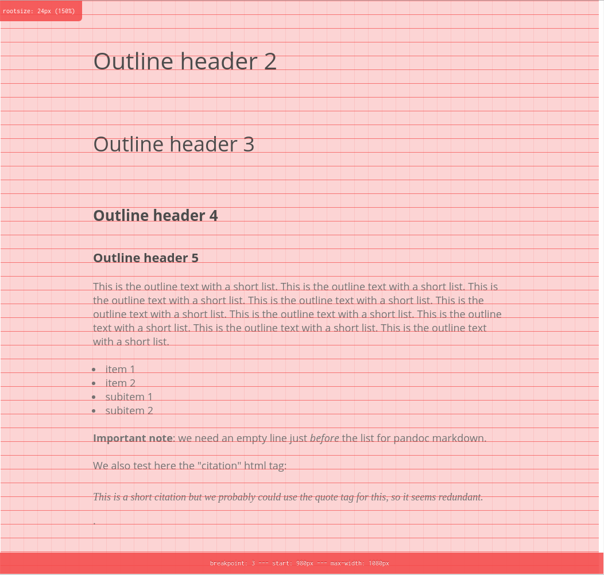
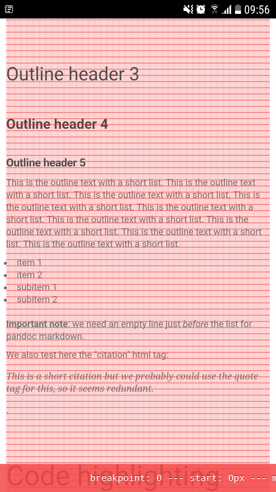

---
author: "Marc Weber"
title: "Markdown template for scientific report using pandoc"
date: 2017.09.26
link-citations: "true"
css: "../CSS/pandoc.css"
bibliography: "bibliography.bib"
wordpress_site_url: "www.wordpress.org/site"
wordpress_username: "username"
wordpress_status: "draft"
wordpress_update_post_if_exists: "true"
wordpress_use_quicklatex: "true"
wordpress_toc: "true"

---

# Background

## Introduction

This document is a template for academic writing, science notebook records and reports. It is written in the Markdown format: it’s plain text, human-readable, and can easily be translated into other formats. It allows to write easily structured text with figures, mathematical formulas and bibliographic references without bothering about formatting. One of the biggest advantage is that by separating writing from formatting, I can keep a single source file in a lightweight text format and generate several different output documents in an automatic fashion. These output, for the moment, are: i) a PDF document generated by LaTeX, ii) a stand-alone HTML with integrated images and iii) a Wordpress post on my personal website.

Resources:

+ [Writing academic papers in plain text with Markdown and Jupyter notebook | Sylvain Deville](https://sylvaindeville.net/2015/07/17/writing-academic-papers-in-plain-text-with-markdown-and-jupyter-notebook/)
+ [Writing Workflow 2016, Part 1: Markdown Writing Environment · v & r](http://verifyandrepair.com/04-11-2016/writing-workflow-2016-markdown-environment/)

## Citations

### Citations

Citations are managed by the `pandoc-citeproc`  package (see [pandoc manual section about citations](http://pandoc.org/MANUAL.html#citations)). The use is as follows, now I want to insert an inline citation here: @Gillespie1977. A citation in square brackets format it with parenthesis: [@Miller1965]. Then, I could also use a grouped citations to multiple references like this: [@Danino2010;@Prindle2012]. We can also use citations in footnotes ^[Si2017].

Citations go inside square brackets and are separated by semicolons. Each citation must have a key, composed of ‘@’ + the citation identifier from the database, and may optionally have a prefix, a locator, and a suffix. To make your citations hyperlinks to the corresponding bibliography entries, add `link-citations: true` to your YAML metadata. 

# Outline header 1

## Outline header 2

### Outline header 3

#### Outline header 4

##### Outline header 5

This is the outline text with a short list. This is the outline text with a short list. This is the outline text with a short list. This is the outline text with a short list. This is the outline text with a short list. This is the outline text with a short list. This is the outline text with a short list. This is the outline text with a short list. This is the outline text with a short list.

+ item 1
+ item 2
  + subitem 1
  + subitem 2
  
**Important note**: we need an empty line just *before* the list for pandoc markdown. In other markdown flavors this is not necessary.

We also test here the "citation" html tag: <cite>This is a short citation but we probably could use the quote tag for this, so it seems redundant.</cite>.

# Code highlighting

This is an inline code example in html `<pre class="lang:python">code example</pre>`{.html}.

This is a code block in python language:

```python
print("this is a test")
def new_function(var1=23):
    return [x for x in range(10) if x > 2]

raise SystemExit
```

This is a pre block:

```
print("this is a test")
def new_function(var1=23):
    return [x for x in range(10) if x > 2]

raise SystemExit
```

This is a code cell in jupyter notebook:


```python
# css: "/users/lserrano/mweber/Research_Dropbox/Python_mwTools/CSS_for_scientific_reports/pandoc.css"
# css: "/users/lserrano/mweber/Research_Dropbox/Python_mwTools/CSS_for_scientific_reports/github-pandoc.css"
print("test")
def function(arg):
    return list([x for x in range(0,10)])
```

# Latex math

Latex formulas are rendered by different plugins depending on the output file format. The html for wordpress output will use [QuickLatex](http://www.holoborodko.com/pavel/quicklatex/) wordpress plugin. The self-contained html output will use [MathJax](http://docs.mathjax.org/en/latest/index.html) script. And the pdf output will use the xelatex Latex engine.

#### How to write latex expressions in the markdown master file

In the *markdown master file*, we should wrap latex expression with tags that are understood by both the jupyter latex engine and the pandoc markdown math syntax, namely:

+ inline math `$ ... $`
+ display math `$$ ... $$`
+ math environments, e.g. `\begin{align} .. \end{align}`

Then, we will have to tweak pandoc to correctly convert these tags to tags compatible with the different latex engines of each output format.

#### Editing the markdown master file with Jupyter notebook

If using the jupyter notebook as an editing tool for the markdown master file, we would like to use latex tags that are recognized by the the jupyter markdown rendering engine. Note that in the case of editing the markdown master file with a simple text editor, this would not be important. As mentionned in the [documentation](http://jupyter-notebook.readthedocs.io/en/latest/examples/Notebook/Working%20With%20Markdown%20Cells.html#LaTeX-equations), jupyter uses MathJax to render latex, however with some limitations that are not reported in the documentation. 

+ inline math `$ ... $`
+ display math `$$ ... $$`
+ math environments (at least `align` and `multline`, probably all environments supported by MathJax)

#### Pandoc markdown to pdf using xelatex

From the pandoc [documentation](http://pandoc.org/MANUAL.html#math):

> Anything between two \$ characters will be treated as TeX math. The opening \$ must have a non-space character immediately to its right, while the closing \$ must have a non-space character immediately to its left, and must not be followed immediately by a digit. Thus, \$20,000 and \$30,000 won’t parse as math. If for some reason you need to enclose text in literal \$ characters, backslash-escape them and they won’t be treated as math delimiters.

+ inline math `$ ... $` with the whitespace restrictions.
+ display math `$$ ... $$`
+ math environments

#### Wordpress post with QuickLatex plugin

[QuickLatex](http://www.holoborodko.com/pavel/quicklatex/) supports many Latex features, as AMS math, and also custom preamble, which makes it very powerful. Also, all equations are rendered as SVG images, which display crisp at every zooming scale. Because all equations are rendered once and included as SVG images in the post, the load on the client browser is null resulting in fast download and display of the webpage, unlike MathJax script. The supported latex tags are the same as for MathJax:

+ inline math `\( ... \)` (`$ ... $` is also supported but is deactivated on my wordpress installation!).
+ display math `\[ ... \]` and `$$ ... $$`
+ math environments: `equation`, `align`, `displaymath`, `eqnarray`, `multline`, `flalign`, `gather`, and `alignat`.

Note: unfortunately quicklatex is parsing inside `<code></code>` block. This is why double dollar syntax was getting displayed as latex display equation with dots `...` inside. This could happend quite often when printing inline code with regex with escaped parenthesis, for example `re.sub(r'\(test\)', r'\1', "string")`. There is no problem in seperate code block because these get in a `pre` block, which QuickLatex does not parse. Solution is to enclose inline code in a `span` tag with `crayon-inline` class, which will enable basic syntax highlighting while preventing any latex parser to mess with it: `<span class="decode:true crayon-inline">re.sub(r'\(test\)', r'\1', "string")</span>`{.html}.

```python
import re
re.sub(r'\(test\)', r'\1', "string")
0 < 1
re.sub(r'$$abc$$', r'a$$abcd$$', string) = "this should not be parsed as latex expression"
```

Now we have to choose one particular syntax for inline and block code, because there is no standard in html5 about how to do that. People either use specific tags: `<codeblock>`, `<code>`{.html}, or the more general `<pre>` tag with class attribute that defines if the code is inline or in block. The Crayon plugin for syntax highlighting that I use on the wordpress site prefers 1) for code block the `<pre class="lang:python">` tag with the class defining the language, and 2) for inline code the `<span class="lang:python decode:true  crayon-inline ">` tag with the class giving the language attribute and the `crayon-inline` attribute which defines to insert the code inline. We will use these tags in the output for wordpress post.


#### Self-contained html with MathJax script

[MathJax](http://docs.mathjax.org/en/latest/index.html) preprocessor can look for whatever markers to define math delimiters. In the default configuration, the latex tags are

+ inline math `\( ... \)`. Important: `$ ... $` is **not** supported by default.
+ display math `$$ ... $$`
+ math environments
+ Need spaces around `<` and `>` symbols in order not to interfere with html syntax, example: `$x < y$`

I wish MathJax could render also all equations as SVG and include them as URI images in the self-contained html file. However, is seems [not possible at this time](https://github.com/jgm/pandoc/issues/682). Latex tags get correctly exported with the pandoc tool by passing the `--mathjax` option.


### Examples of LaTeX formulas in markdown master file

#### Inline math

inline latex expression examples enclosed by `$ .. $`: $\exp\left(e^{\tau}\right) < 1$

+ jupyter nbconvert to Markdown: `$\exp(e^{\tau)} < 1$` (unchanged)
+ pandoc markdown to pdf using xelatex: ok
+ self-contained html with MathJax script: ok. Converted to html code `<span class="math inline">\(\exp(e^{\tau)} &lt; 1\)</span>`{.html}
+ wordpress post: ok, enclosed in span class and recognized by QuickLatex `<span class="math inline">\(\exp(e^{\tau)} &lt; 1\)</span>`{.html}

Important: inline latex expression examples enclosed by `\( .. \)` is **not compatible** with Pandoc markdown math syntax and will result in an error in pandoc conversion to pdf using latex engine, for example.

#### Display math

display latex expression example enclosed by `$$ ... $$`: $$\exp\left(e^{\tau}\right) < 1$$

+ jupyter nbconvert to Markdown: `$$\exp(e^{\tau)} < 1$$` (unchanged)
+ pandoc markdown to pdf using xelatex: ok
+ self-contained html with MathJax script: ok. Converted to html code `<span class="math display">\[\exp(e^{\tau)} &lt; 1\]</span>`{.html}
+ wordpress post: ok, enclosed in span class and recognized by QuickLatex `<span class="math display">\[\exp(e^{\tau)} &lt; 1\]</span>`{.html}

#### Math environments

`align` environment:

\begin{align}
x + y &< 0 \\
\int_{i=0}^N e^{\alpha t} dt &= \pi
\end{align}

+ jupyter nbconvert to Markdown: (unchanged)
+ pandoc markdown to pdf using xelatex: ok
+ self-contained html with MathJax script: ok. Left unchanged in html code.
+ wordpress post: ok, Left unchanged in html code and recognized by QuickLatex.

`multline` environment:

\begin{multline}
x + y + c + a + b + d + e + f + g + x + y + c + a + b + d + \\
e + f + g + x + y + c + a + b + d + e + f + g + \\
+ 4 + a + b + d < \pi
\end{multline}

+ jupyter nbconvert to Markdown: (unchanged)
+ pandoc markdown to pdf using xelatex: ok
+ self-contained html with MathJax script: ok. Left unchanged in html code.
+ wordpress post: ok, Left unchanged in html code and recognized by QuickLatex.

#### Latex in code

The expressions in inline code and code blocks should **not** get parsed as latex expression. Examples inline: `code with latex-like tags inside $s = 1$ and $$x + y < 0$$`. And codeblock,

```python
print("code with latex-like tags inside")
$s = 1$
$$x + y < 0$$
```

+ jupyter editor: unfortunately, the latex expressions inside code blocks gets rendered as LateX expression.
+ jupyter nbconvert to Markdown: ok (unchanged)
+ pandoc markdown to pdf using xelatex: ok
+ self-contained html with MathJax script: ok.
+ wordpress post: ok

### Latex macros

New Latex commands can be defined by the `\newcommand` command inside the markdown file. They will be parsed and macros will be replaced every in the file when producing html output. When producing latex pdf output, the macros will be included in the latex header.

<!-- Latex commands -->
\newcommand{\ee}[1]{\cdot 10^{#1}\ }

# Images

Images can be inserted into Markdown documents in a variety of ways, each of one is not compatible with the external software that will convert markdown into PDF, html, or other document type. With Pandoc, the syntax is:

![\emph{Phase transition in a growing population of toggle switches interfaced by QS leading to the high $u$ state.} (A) Time evolution of concentration $u$ in color code for an exponentially growing population of toggle switches interfaced by QS. $D=2$, cell cycle $\tau=50$, cell cycle deterministic/stochastic weight coefficient $\lambda = 0.8$, $V_{\text{ext}}=600\ \mu\text{m}^3$, $\alpha$ and $\beta$ are kept constant. During exponential growth, cells randomly jump between the two stable states, upon reaching a critical population size at $t \sim 349$ and $N \sim 144$, beyond which the majority of cells lock into the high $u$ state. $\lvert {\mkern 1.5mu\overline{\mkern-1.5mu M \mkern-1.5mu}\mkern 1.5mu} \rvert(t)$ exhibits large fluctuations at the beginning of the simulation due to small system size, then remains close to zero in the unordered state and finally reaches unity when entering the ordered state. (C) External volume $V_{\text{ext}}(t)$ (solid line) and total volume of the cells $\sum_i^{N(t)} V_i(t)$ (dashed line). Cell coupling gets stronger when the external volume decreases, due to higher concentration of signaling molecules in the environment. Intersection of both lines indicates a ratio of cell volume to external volume $r$ equal to the previous simulation with fixed system size. Beyond this point the coupling strength is stronger and leads to the phase transition. The increase in the system size $N$ with time enhances the phase transition.](Images/exponential_growth_lowU_panels.png){#fig:isingmodel1 width=60%}

Note that the figure is correctly rendered by the Jupyter notebook interface, **however the figure size directive is not taken into account**. The only way to change the image size in the jupyter interface, which uses standard markdown, is to use an HTML tags (see [python - How to Include image or picture in jupyter notebook - Stack Overflow](http://stackoverflow.com/questions/32370281/how-to-include-image-or-picture-in-jupyter-notebook)). However, images inserted by html tag will probably not get parsed correctly by pandoc (to verify).

Also, we used a custom syntax for the figure captions, in order to be able to display the captions below the plot in a markdown rendered cell in the jupyter notebook. These captions will be corrected for the pandoc markdown syntax in the parser script, such that:

```
{#fig:fig_id width=60%}[[figure captions text.]]
```

displays the captions below the figure in the jupyter notebook. The markdown master file will be transformed into the correct pandoc markdown syntax:

```
{#fig:fig_id width=60%}
```

The figure number can be automatically referenced using the package `pandoc-fignos` (see [github webpage](https://github.com/tomduck/pandoc-fignos)) this is a reference to the figure @fig:isingmodel1.

##### Other markdown compatible syntaxes for inserting image

HTML tag:

``

General markdown:

``

pandoc style:

`{ width=50% }`

pandoc style with fignos package:

`{#fig:id}`

# Styling

The HTML outputs are styled with custom CSS sheet. I used the package MegaType (SCSS template) to create a responsive design and define all font sizes and line heights of the different elements in order to create a (almost perfect) vertical rhythm, aligning the text baseline on a baseline grid.

{width=80%}

{width=50%}

More information:

+ [Web typography is broken. Here’s how we can fix it – Thomas Bredin-Grey – Medium](https://medium.com/@tbredin/a-jolly-web-typesetting-adventure-42948ab0d1dd)
+ [StudioThick/megatype: Execute typographic structure with ease](https://github.com/StudioThick/megatype)
+ [cap-height calculator](http://codepen.io/elrumordelaluz/details/ZGpvvE) (useful to calculate the cap height of some common fonts).

# Bibliography

Note: the Bibliography header is not automatically included by pandoc.
